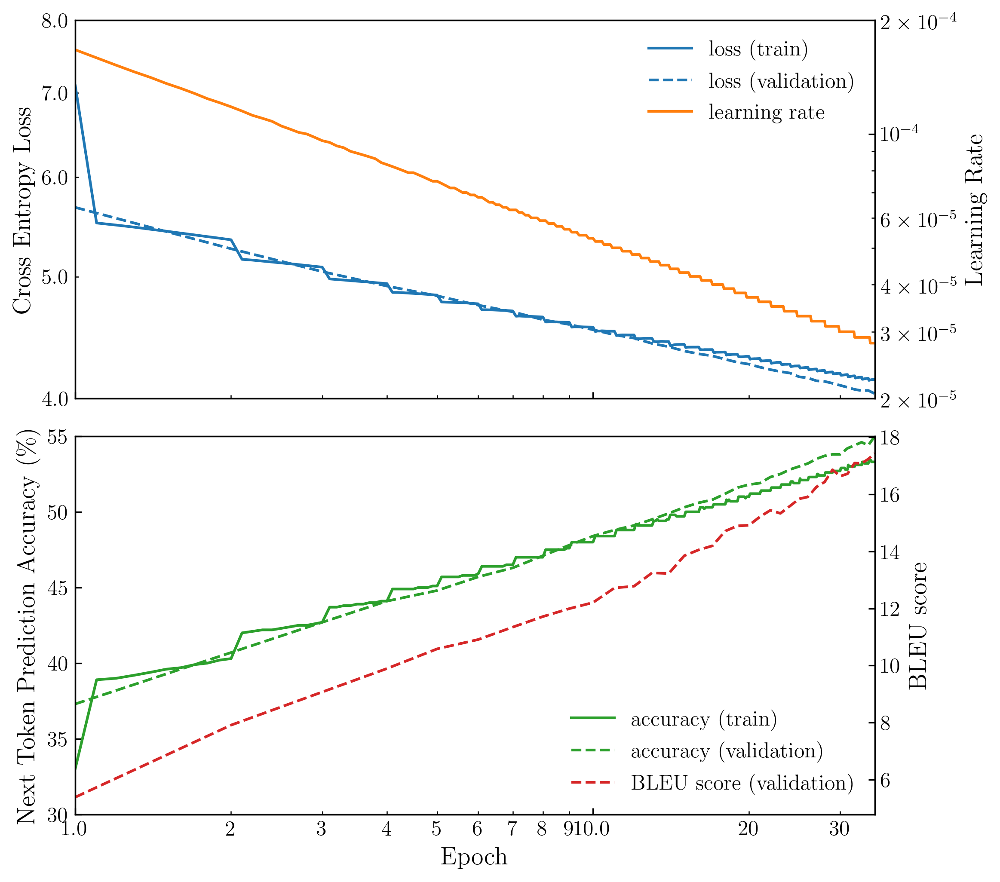

# Goal

Reproduce the Transformer Model following ["Attention is All You Need" by Vaswani et al. 2017](https://arxiv.org/abs/1706.03762)

## Result

Here's the training history of the transformer I implemented and trained on the WMT14 German-English translation task.



In the figure above, I showed the average cross entropy loss per example, the learning rate damped according to the formula in the paper (might differ because batch size is not the same), the accuracy of predicting the next token given all previous tokens from the target (label) and all the source tokens (that it translates from), and the BLEU score on the validation set evaluated with the `sacrebleu` package.

I stopped at the 35-th epoch to save energy, with a final BLEU score of 17.4 on the validation set. Compared to the number BLEU = 25.8 in the paper, there's a long way to go. But we can also find that my training is far from finished as there's no sign of plateau or overfitting yet.

The training took 4 days on an RTX 4090, basically 3 hours per epoch. While Vaswani et al. got much better results with only 12 hours training on four P100, which I believe had approximately the same computing power as an RTX 4090. Appearently their model learnt way faster than mine.

To get a sense of the model's translation power, here're some random examples from the test set (Each example is in the order of German, English, Model translated English):

1.
    „In diesem Fall habe ich Zoomlion geschädigt ebenso wie die gesamte Nachrichtenbranche und ihre Fähigkeit, das Vertrauen der Öffentlichkeit zu gewinnen“, erklärte er gegenüber dem staatlichen Nachrichtensender CCTV.

    "In this case I've caused damages to Zoomlion and also the whole news media industry and its ability to earn the public's trust," he told state broadcaster CCTV.

    “ In this case , I have damaged CC TV as well as the entire news industry and its ability to gain public confidence ,” he explained to the CC zoom ing station .

1. 
    Man habe, so Airbus, Untersuchungen durchgeführt, die belegten, dass ein zusätzliches Zoll (2,54 cm) pro Sitz die Schlafqualität um 53 Prozent steigere.

    Airbus says it has commissioned research suggesting an extra inch in seat width improves sleep quality by 53 per cent.

    The investigations carried out by Airbus have shown that the quality of sleeping ( 53 . 54 cm per seat ) was reduced by 2 percent .

1.
    Neben der uns geläufigen Materie, aus der Sterne, Planeten und Lebewesen wie wir bestehen, gibt es Dunkle Materie, deren Schwerkraft Galaxien und Galaxienhaufen zusammenhält, und Dunkle Energie, durch deren Wirken sich die Expansion des Weltalls beschleunigt.

    Alongside the materials familiar to us, from which stars, planets and life forms such as ourselves are composed, there exists dark matter, the gravitational force of which holds galaxies and galaxy clusters together, and dark energy, the effects of which accelerate the expansion of the universe.

    Besides the dark matter , stars , galax ies , galax ies and how we dress up together , there are galax ies , dark galax ies , and their energy is accelerated by their expansion , and by the expansion of the planet , the matter is made up of .


## File Structure

-   `prototype/`

    Tried to built the Transformer Base Model using `torch.nn.Transformer` for prototyping the model and the training/evaluating process.

-   `transformer_from_scratch/`

    Following the steps from the paper, built Transformer Base Model with basic PyTorch modules. Trained on WMT14 de-en translation dataset for 10 epochs, which was 30 hours on an RTX 4090. The final BLEU score is 10.4

    -   `transformer_from_scratch.ipynb`

        Prototyping the training and evaluation of the "from scratch" version. Superceded by `train.py` which performs massive training and evaluation, stored in the log file, and plotted by `plot.ipynb`.

    -   `tokenizer.py`

        Implements the Byte-Pair Encoding tokenizer.

    -   `dataset.py`

        Implements the dataset. Currently using the WMT14 de-en.

    -   `model.py`

        Implements the transformer architecture.

    -   `transformer.py`

        Implememnts the wrapper for the transformer model.

    -   `utils.py`

        Implements utility functions.

    -   `train.py`

        A script for long-term training.

## Dataset

Using [WMT 2014 English-German dataset](https://huggingface.co/datasets/wmt14), which contains 4.5M training examples, 3K validation and 3K test examples.

By default, the dataset is downloaded at `~/.cache/huggingface/datasets/`. In the code, I've turned off dataset caching
to avoid disk explosion :)

The longest example turns into 14000+ tokens. Such a sequence length would require 300GB+ use of memory. Don't even think about it. I ended up using a fixed sequence length of 128 tokens, since I found that 99.6\% of the corpus are under 256, 98.8\% under 128, and 87.5\% under 64. A sequence length of 128 is a sweet spot in my opinion.

Noticably, I also tried using variational sequence length such as splitting the training set into blocks of length 16, 32, 64, 128. This did reduce the training time into 2 hours per epoch (50\% speed up than the fixed length random order), but it also results in a BLEU score of 0.0 after one epoch, i.e., no translation ability at all.

## Tokenizer

Byte-Pair Encoding (BPE) tokenizer. Fed the tokenizer with the whitespace removed dataset, and let it learn 37000 vocab. I did not join the etyma and affix back after the translation. That's why you can see a lot of wierd spaces in the translation examples at the beginning.

## Environment

I use `miniconda` to manage my environments. My default channel is `conda-forge`.

```bash
# create virtual environment
conda create -n learn-transformer python=3.10 -y
conda activate learn-transformer
# install pytorch (Apple)
conda install pytorch::pytorch torchvision torchaudio -c pytorch -y
# or install pytorch (Nvidia)
pip install torch torchvision torchaudio --index-url https://download.pytorch.org/whl/cu118
# install tokenizer
pip install tokenizers
# install HuggingFace datasets
pip install datasets
# install sacrebleu for evaluating with BLEU score
pip install sacrebleu
# install dev tools
conda install jupyter matplotlib colorama -y
```

## Potential Improvements

-   Better data cleaning and tokenization

    I did minimal treatments (simply removing white spaces) to tokenize the data. Could've done better. Might improve the training and the translation performance.

-   Pre-trained embedding layer

    I might help speed up the training if I could use a pre-trained embedding layer from NLP classification tasks. So that the model won't need to learn both languages from scratch from the translation dataset.

-   Match examples

    Concatenating short examples into long ones helps reduce wasteful paddings, thus speed up training. It could also affect the quality of the learning (just a conjesture, not sure positive effects or negative).

-   Learning rate

    Could try tweaking the learning rate, since my implementation had different batch size than the paper. My training examples are also less dense in terms of information density.

-   Beyong Attention is All You Need

    Recent architectures such as GPT or Llama are similar to Transformers in Attention is All You Need but with different activation functions such as SiLU, GELU, and they add more layer normalization layers as well.